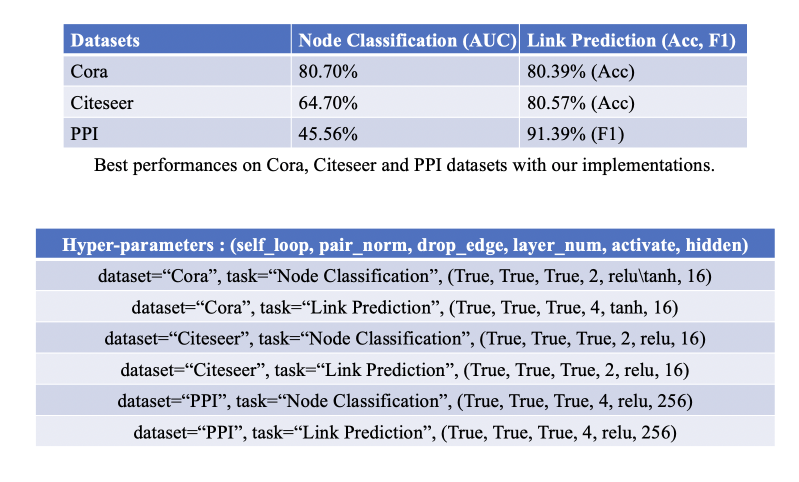

## HandMade implementation of Graph Convolutional Neural Networks
This repo contains my implementation of GCN based on PyTorch (the framework is adpated from https://github.com/tkipf/pygcn),
and besides I make it support different datasets (cora, citeseer and ppi), different tasks (node classification and link prediction) and any other hyperparameters (e.g., layer_num, pair_norm, self_loop, activate, hidden, ...).
```
support for the following parameters:
--dataset : "cora", "citeseer" and "ppi"
--task : "nodecls" (Node Classification) and "linkpred" (Link Prediction)
--layer_num : 2, 3, 4, 5 ,... (how many gcn layers to be used to construct model)
--pair_norm : True, False (whether to use pair norm or not)
--drop_edge : True, False (whether to use DropEdge method when training)
--self_loop : True, False (whether to add self loop to ADJ matrix)
--activate : "relu", "sigmoid" and "tanh"
--hidden : 16, 64, 256 (dimension of hidden vector in GCN)
```
#### Download and Preprocess datasets
Cora dataset : https://linqs-data.soe.ucsc.edu/public/lbc/cora.tgz 
Citeseer dataset :  https://linqs-data.soe.ucsc.edu/public/lbc/citeseer.tgz
PPI dataset :  http://snap.stanford.edu/graphsage/ppi.zip 
```
mkdir datasets
# download 3 datasets into datasets dictionary
unzip ppi.zip
tar zxvf cora.tgz
tar zxvf citeseer.tgz
# for citeseer dataset, we need to preprocess it
python $home/deeplearn_lab4_gcn/src/preprocess_citeseer.py
# use the `.new` generated files to replace the original ones.
```
#### Package dependency (environments)
```
python 3.8
pytorch 11.3 (the newest version, cuda version)
cuda 11.7

# key point: install pytorch-geometric package 

down load pytorch-geometric dependency wheels here : https://data.pyg.org/whl/  
(according to your python, pytorch, cuda versions)
reference : https://blog.csdn.net/weixin_47196352/article/details/115795660?spm=1001.2101.3001.6650.3&utm_medium=distribute.pc_relevant.none-task-blog-2%7Edefault%7EESLANDING%7Edefault-3-115795660-blog-128611141.pc_relevant_landingrelevant&depth_1-utm_source=distribute.pc_relevant.none-task-blog-2%7Edefault%7EESLANDING%7Edefault-3-115795660-blog-128611141.pc_relevant_landingrelevant&utm_relevant_index=4
```
#### Introduction to main tunable hyper-parameters
--dataset : "cora", "citeseer" and "ppi"
--task : "nodecls" (Node Classification) and "linkpred" (Link Prediction)
--layer_num : 2, 3, 4, 5 ,... (how many gcn layers to be used to construct model)
--pair_norm : True, False (whether to use pair norm or not)
--drop_edge : True, False (whether to use DropEdge method when training)
--self_loop : True, False (whether to add self loop to ADJ matrix)
--activate : "relu", "sigmoid" and "tanh"
--hidden : 16, 64, 256 (dimension of hidden vector in GCN)
#### Experiment Results
Overall best results on Cora, Citeseer and PPI datasets and corresponding hyper-parameters are listed as follows:

#### Example uses (to quickly reproduce experiments on different datasets with different hyperparameters): 
to run a single experiment:\\
`CUDA_VISIBLE_DEVICES=1 python train.py --dataset ppi  --self_loop True --epochs 300 --layer_num 4 --pair_norm True --activate relu --task linkpred --hidden 256` \\
to quickly reproduce our results with one click:\\
`bash run_one_click_ppi.sh > result.ppi.txt` \\
`bash run_one_click_cora_cite.sh > result.cora.citeseer.txt`

#### References
my implementation is on the basis of https://github.com/tkipf/pygcn
```
@1: Mu Li's tutorial:
https://www.bilibili.com/video/BV1iT4y1d7zP/?spm_id_from=333.337.search-card.all.click&vd_source=0b94491685a644f4e70b2ffc09079337
@2: Google Research's distill blog:
https://distill.pub/2021/gnn-intro/
@3: pygcn tutorial:
https://www.bilibili.com/video/BV1Y64y1B7Qc/?spm_id_from=333.337.search-card.all.click&vd_source=0b94491685a644f4e70b2ffc09079337
@4: pygcn github (official implementation of GCN in pytorch):
https://github.com/tkipf/pygcn
@5: GCN original paper: (Semi-Supervised Classification with Graph Convolutional Networks, ICLR'17, Thomas N.Kipf, Max Welling)
https://arxiv.org/abs/1609.02907
@6: a blog around GCN:
https://ai.plainenglish.io/graph-convolutional-networks-gcn-baf337d5cb6b?gi=a61c544a76c5
@7: how to use GCN to deal with link prediction task?
https://blog.csdn.net/Cyril_KI/article/details/125956540
@8: EdgeDrop paper: https://arxiv.org/abs/1907.10903
@9: PairNorm paper: https://arxiv.org/abs/1909.12223
@10: an example of processing PPI dataset:
https://blog.csdn.net/KPer_Yang/article/details/128810698?utm_medium=distribute.pc_relevant.none-task-blog-2~default~baidujs_baidulandingword~default-0-128810698-blog-112979175.pc_relevant_multi_platform_whitelistv3&spm=1001.2101.3001.4242.1&utm_relevant_index=3
```


